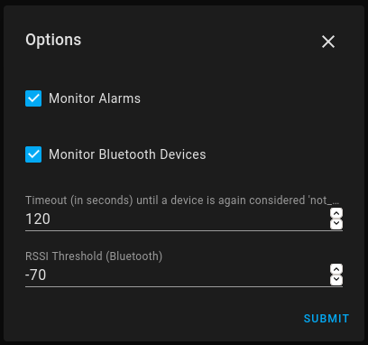

## Google Home Integration for [Home-Assistant](https://home-assistant.io)

### Fork of the original component before the [deprecation](https://github.com/home-assistant/home-assistant/pull/26035) with a workaround.

This is a custom component that allows tracking alarms/timers of google/nest home devices and/or use their buildin bluetooth chips for presence detection.

*Warning*: Version 0.4 changed the way the alarm/timer sensors work, you will need to adjust your automations accordingly.

## Installation

1. Setup this repository as a custom repository in HACS.
2. Search under Integrations for "Googlehome" and hit install.
3. Restart HA
4. Go to Integrations and setup the Googlehome integration. You will need to sign in with a google account linked to your google home devices.
5. (Alternatively setup the integration via a google master token, see [#14](https://github.com/Drakulix/googlehome/issues/14))


## Usage

- Enable the features you want to use in the Integrations tab. 
- When bluetooth monitoring is enabled devices will popup as device_tracker entries. You can use `ghname` to match which google home device discovered your bluetooth device and `rssi` to track the distance. 
- When monitoring alarms/timers is enabled two sensors will be added to your home-assistant instance per google home device. The `pending` attribute contains a sorted list of pending alarms/timers for more advanced automations using templates. 
- The state alternates between `none` (if none are set), `pending` (if any alarms/timers are set) and `ringing`.

For a quick automation when an alarm is dismissed (and no new / snooze alarm has been set) you may use an automation like:
```yaml
alias: Alarm
description: ''
trigger:
  - platform: state
    entity_id: sensor.schlafzimmer_alarm
    from: ringing
    to: none
condition: []
action:
  - service: scene.turn_on
    data: {}
    entity_id: scene.test
mode: single
```

## License

The Project is Licensed under the Apache License just like the original home-assistant code.

The included fork of the googledevices python lib is licensed under the MIT License just like the original.

I do only own the copyright on the patches to the original code, everything else is not mine.